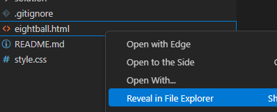
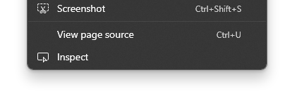
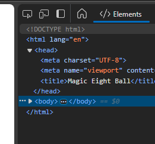
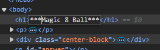

# Lab Magic Eight Ball

For this lab, you will be a simple webpage that will randomly generate an answer based on the famous 'magic eight ball'. 

- [Lab Magic Eight Ball](#lab-magic-eight-ball)
  - [:star: Learning Outcomes :star:](#star-learning-outcomes-star)
  - [:fire: Tasks](#fire-tasks)
    - [HTML framing, semantic markup](#html-framing-semantic-markup)
      - [Adding to the body](#adding-to-the-body)
    - [Functionality / Typescript](#functionality--typescript)
      - [Compile your Typescript into Javascript](#compile-your-typescript-into-javascript)
      - [Run the webpage](#run-the-webpage)
    - [Styling with CSS](#styling-with-css)
  - [🚨 Submission Instructions](#-submission-instructions)
  - [:memo: Rubric](#memo-rubric)


## :star: Learning Outcomes :star:
* Be able to write back HTML focusing on semantic markup
* Be able to write basic CSS for styling
* Be able to write basic typescript -> javascript to manipulate the DOM. 


## :fire: Tasks

To better understand a web page - we will break down the page into the three major components. 

Throughout the lab, you will have discussion questions. You should fill out your answers in assignment [README.md](../README.md) in the discussion section. This will give you a study guide for future understanding, and help solidify the information.

:memo: [Discussion Item]: Define the differences between HTML, Javascript, and CSS - make sure you use the terms semantic, functional, and style - and how they relate to each component of a webpage. 


### HTML framing, semantic markup

HTML is designed to setup the semantics of the webpage (even though it's purpose has been muddied over the years). Most notably, it breaks up a text document by
defining `head` information about the document itself. `body` is content to display. That content to display can have `header`, `footer`, `headings` (as H1, H2, etc), `div` for divisions, `p` for paragraphs and more! While there are many designs that don't follow this pattern, good designers attempt to keep to it as strictly as possible. 

However, as you will quickly find, it doesn't look "pretty" by default. 

:fire: Take the following bit of HTML, and copy it into [eightball.html](../eightball.html). 

```html
<!DOCTYPE html>
<html lang="en">
<head>
    <meta charset="utf-8">
    <meta name="viewport" content="width=device-width, initial-scale=1.0">
    <title>Magic Eight Ball</title>
</head>
<body>
    
</body>
</html>
```

This setups the basic layout for the webpage, though there is very little information in it (just a blank page!).  However, if you open eightball.html in your browser, you will see the blank page (you should do that now). We recommend using your browser instead of the preview window in VSCode for now. 



Note: on a mac, it may say Finder.  Once the file appears, go ahead and double click, and it should open in your preferred browser. 

At this point, you should just be seeing an empty page. But if you right click on the page and go to inspect, you will have a side panel open up that will show the full page information. 

Here is a quick screen shot of inspect on my computer, though it may vary from computer to computer on the location when you right click in the browser window. 



After you click on it, if you are in a chromium based browser such as chrome, edge, or safari, it will open as a side bar. 



:memo: [Discussion Item]: What are elements in the `head`? What ones do you know? Which ones do you not know (search online what they mean)? 

> [!TIP]
> This is a great point to commit your project if you haven't yet. 
> Good development has commits at key points, which is encouraged in this course.

#### Adding to the body

Great, now lets add something useful in the body. :fire: Add the following between
the body tag. Note we kept the body tags in there, so you can see what
we mean by 'adding between' means. In the future, we won't have them. 

```html
<body> <!-- note this is showing you are in the body, don't duplicate -->
    <h1>Magic 8 Ball</h1>
    <p>Add a description here</p>
    <!-- you will add a div and paragraph here, see below -->
    <footer>&copy; Your Name</footer>
</body>
```

Go back your webpage in the browser, and click the refresh button.  You should now see the content on the page. 

Now, lets add the button and area we are going to update if people ask a question. :fire: Copy the following after the `</p>` and before the `<footer>` tags.

```html
<!-- to be added between the P and footer element -->
    <div>    
        <button type="button" id="ask">Ask</button>
    </div>
    <p id="answer"></p>
```

:memo: [Discussion Item]: What is the `type` used for with button. Why would we have it `button` and not `submit` in this case? Note that submit is more common! 

Go ahead and refresh your page again. While it looks alright, "add your description here" doesn't make much sense, so :fire: update the instructions of what we want people to do. In this case, if they click 'ask' a 'magic eight ball' random answer will be displayed. You could put something as simple as "Welcome to the Magic Eight Ball! Ask a question and click the button to see your answer." 

:memo: [Discussion Item]: Using the inspect side bar, highlight various elements. What is it doing? What happens if you change an element in the side bar, then refresh?

For changing an element, you can double click on it, or right click depending on what you want to do. 



At this point, we have a webpage, but it doesn't do much other than display information (and a button that does nothing). Did you remember to commit?

### Functionality / Typescript

Now let's add functionality which means javascript (ECMAScript). However, javascript has a lot of design choices that make it hard for people with an OOP background (technically, javascript is a prototype language not OOP), so we will focus on writing in typescript and letting the typescript compiler "convert" it to javascript. This is becoming more and more common in web development, and TS is slowly taking over JS for that reason. 


:fire: copy the following into [src/eightball.ts](src/eightball.js)

```ts
function getRandomAnswer(): string {
    const randomIndex = Math.floor(Math.random() * magicEightBallAnswers.length);
    return magicEightBallAnswers[randomIndex];
}

function updateAnswer(answer: string): void {
    const answerElement = document.getElementById("answer");
    if (answerElement) {
        answerElement.textContent = answer;
    }
}


function handleAskButtonClick(): void {
    const answer = getRandomAnswer();
    updateAnswer(answer);
}


function initializeEventListeners(): void {
    const askButton = document.getElementById("ask");
    if (askButton) {
        askButton.addEventListener("click", handleAskButtonClick);
    }
}
```

:task: Write comments in the typescript describing what each function does (and lines if the line isn't clear). This may seem tedious, but it will help you get a better idea of what is going on.  Make sure you have at least one line that highlights what `const` does for part of the variable declaration. 

```ts
document.addEventListener("DOMContentLoaded", initializeEventListeners);
```

#### Compile your Typescript into Javascript

To compile (convert) typescript into javascript run the following command. It is assuming you are running in the default assignment directory.

```terminal
tsc src/eightball.ts --outDir .
```
To break down the command:
* `tsc` is the typescript compiler command (installed by `npm`)
* `src/eightball.ts` - files you want to convert to javascript
* `outDir` - by default it saves the files in the same location of the .ts files, 
  but it is common to keep .ts separate from the .js. Since we were running from the 
  assignment home directory, this should create the .js file in the same directory as the .html file. 

> [!WARNING]
> Make sure the `.js` is in the same file as your `.html` file - if not, go ahead and move it. 

As we start working with full projects, you will find this will be setup by configuration files. 


#### Run the webpage

Inside the `<head>` section of your html file, add the following line. (often added just before the `</head>`). 

```html
<script src="eightball.js"></script>
```

This will link the javascript file to be loaded when the webpage loads into a browser

Make sure you you refresh/reload the webpage, and try it out! If done correctly, every
time you click the button, it should randomly update the page with a new message.

> [!IMPORTANT]
> You will notice the page isn't "refreshing/reloading" between button clicks. 
> That is the power of javascript. We will continue to 
> explore throughout the semester on when it is 
> better to update on the server / create a new page, and when it is better to update in
> the page itself via javascript. 


### Styling with CSS

```html
<link rel="stylesheet" href="style.css">
```

```html
 <div class="center-block">   
```


> Most of this course we do not grade based on style outside of functional style (fixed spacing, margins, usability, etc). So if it doesn't look pretty, that is mostly fine! However, we do encourage you to make an attempt at making things look good. 


> [!NOTE]
> While this lab didn't follow the 'common' directory structures, it is common
> to keep javascript and css located in separate folders from the 
> html files. You then reference those locations as part of the file location
> in your link or script tag. 


## 🚨 Submission Instructions

Submit via the assignment link in canvas. You will submit a link to your github repository for this assignment.  

## :memo: Rubric

For labs, TAs will check to see if you completed the lab, but the grade is you completed it or not. 


[Discussion Item]: ../README.md#Discussion%20Items